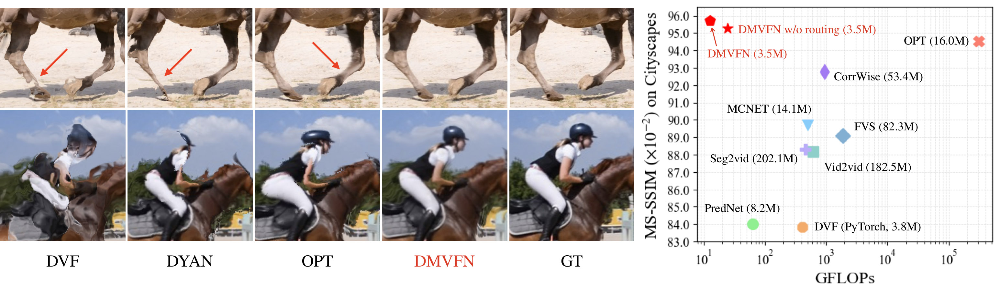

# A Dynamic Multi-Scale Voxel Flow Network for Video Prediction
## [HomePage](https://huxiaotaostasy.github.io/DMVFN) | [Colab](https://colab.research.google.com/github/megvii-research/CVPR2023-DMVFN/blob/main/colab_demo.ipynb) | [arXiv](https://arxiv.org/abs/2303.09875) | [YouTube](https://youtu.be/6retLBLAHDs)
This project is the implementation of our Paper: [A Dynamic Multi-Scale Voxel Flow Network for Video Prediction](https://arxiv.org/abs/2303.09875), which is accepted by **CVPR2023 (highlight✨, 10% of accepted papers).** We proposed a SOTA model for Video Prediction.

[Poster](https://drive.google.com/file/d/1W5MD39Wjp4Ryrv_DMC7QXiCNsiG1AL2x/view?usp=sharing) | [研究历程](https://www.zhihu.com/question/585474435/answer/2946859435) | [中文论文](https://drive.google.com/file/d/1mzJipcWRd1wcpphSIUOszzgxMWMFx40D/view?usp=sharing) | [rebuttal (3WA->1WA2SA)](https://drive.google.com/file/d/1S8tZOokoZNxCBkV1GVLWOlUCCoJA7Bfu/view?usp=sharing) | [Demo](https://youtu.be/rlghCGbAqUo)



supplement and correction of published paper: 1. In Figure 2(a), $I_{t-1}$ and $I_t$ should be swapped; 2. "Our model is trained on four 2080Ti GPUs for 300 epochs, which takes about 35 hours." This sentence refers to the Cityscapes training set; 3. In Table 1, GFLOPs computing for KITTI is on $256\times832$ and on $1024\times512$ for Cityscapes using [fvcore](https://github.com/facebookresearch/fvcore).
## Usage
### Installation

```bash
git clone https://github.com/megvii-research/CVPR2023-DMVFN.git
cd CVPR2023-DMVFN
pip3 install -r requirements.txt
```

* Download the pretrained models from [Google Drive](https://drive.google.com/drive/folders/1QnsnTVU-2IexFNjGhNVRYPqKNviAbkwH?usp=sharing). ([百度网盘](https://pan.baidu.com/s/1l8d1oCzEHDf8JCv1KLIbvA) password:33ly), and move the pretrained parameters to `CVPR2023-DMVFN/pretrained_models/*`

```bash
pip install gdown
mkdir pretrained_models && cd pretrained_models
gdown --id 1jILbS8Gm4E5Xx4tDCPZh_7rId0eo8r9W
gdown --id 1WrV30prRiS4hWOQBnVPUxdaTlp9XxmVK
gdown --id 14_xQ3Yl3mO89hr28hbcQW3h63lLrcYY0
cd ..
```

### Data Preparation

In this section, we will download all parts including training and testing sets. If you only need the test set, please jump to [Directly download test splits](#directly_download_test_splits).

The final data folder `CVPR2023-DMVFN/data/` should be organized like this:

```
data
├── Cityscapes
│   ├── train (Citysapes images in 512x1024)
│   │   └── 000000
│   │   └── ...
│   │   └── 002974
│   ├── test (Citysapes images in 512x1024)
│   │   └── 000000
│   │   └── ...
│   │   └── 000499
├── KITTI
│   ├── train (Kitti images in 256x832)
│   │   └── 000000
│   │   └── ...
│   │   └── 013499
│   ├── test (Kitti images in 256x832)
│   │   └── 000000
│   │   └── ...
│   │   └── 001336
├── UCF101
│   ├── v_ApplyEyeMakeup_g08_c01
│   └── ...
└── vimeo_interp_test
    └── target
        └── 00001
        └── ...
```


**Cityscapes**


* Download the Cityscapes dataset `leftImg8bit_sequence_trainvaltest.zip` from [here](https://www.cityscapes-dataset.com/downloads/).


* Unzip `leftImg8bit_sequence_trainvaltest.zip`.


```bash
unzip leftImg8bit_sequence_trainvaltest.zip
```

* Run ./utils/prepare_city.py
```bash
python3 ./utils/prepare_city.py
```

**KITTI**


* Download the KITTI dataset from [Google Drive](https://www.cvlibs.net/datasets/kitti/raw_data.php). You need to register and login, then download all videos.


* Our training split and testing split are consistent with [YueWuHKUST/CVPR2020-FutureVideoSynthesis](https://github.com/YueWuHKUST/CVPR2020-FutureVideoSynthesis).

```
Videos for training split:
2011_09_26_drive_0001_sync  2011_09_26_drive_0018_sync  2011_09_26_drive_0104_sync 2011_09_26_drive_0002_sync  2011_09_26_drive_0048_sync
2011_09_26_drive_0106_sync  2011_09_26_drive_0005_sync  2011_09_26_drive_0051_sync 2011_09_26_drive_0113_sync  2011_09_26_drive_0009_sync  
2011_09_26_drive_0056_sync  2011_09_26_drive_0117_sync  2011_09_26_drive_0011_sync 2011_09_26_drive_0057_sync  2011_09_28_drive_0001_sync
2011_09_26_drive_0013_sync  2011_09_26_drive_0059_sync  2011_09_28_drive_0002_sync 2011_09_26_drive_0014_sync  2011_09_26_drive_0091_sync 
2011_09_29_drive_0026_sync  2011_09_26_drive_0017_sync  2011_09_26_drive_0095_sync 2011_09_29_drive_0071_sync

Videos for testing split:
2011_09_26_drive_0060_sync  2011_09_26_drive_0084_sync  2011_09_26_drive_0093_sync  2011_09_26_drive_0096_sync
```
* Unzip all files, then reorganize the dataset as follows:

```bash
mkdir train_or
unzip 2011_09_26_drive_0001_sync
mv 2011_09_26_drive_0001_sync/image02/data/ train_or/2011_09_26_drive_0001_sync
```
Do this command for all files. We use image02 and image03 for training.

* Run ./utils/prepare_kitti.py.


```bash
python3 ./utils/prepare_kitti.py
```
* Do the same for the testing split.

**UCF101**

We extract RGB frames from each video in UCF101 dataset and save as `.jpg` image.

Download the preprocessed data directly from [feichtenhofer/twostreamfusion](https://github.com/feichtenhofer/twostreamfusion) for convenience.

```bash
wget http://ftp.tugraz.at/pub/feichtenhofer/tsfusion/data/ucf101_jpegs_256.zip.001
wget http://ftp.tugraz.at/pub/feichtenhofer/tsfusion/data/ucf101_jpegs_256.zip.002
wget http://ftp.tugraz.at/pub/feichtenhofer/tsfusion/data/ucf101_jpegs_256.zip.003

cat ucf101_jpegs_256.zip* > ucf101_jpegs_256.zip
unzip ucf101_jpegs_256.zip
```


**Vimeo90K**

* Download Vimeo90K dataset directly from [here](http://toflow.csail.mit.edu/).
* Unzip the dataset.

### Run

#### 😆Training

For Cityscapes Dataset:

```bash
python3 -m torch.distributed.launch --nproc_per_node=8 \
--master_port=4321 ./scripts/train.py \
--train_dataset CityTrainDataset \
--val_datasets CityValDataset \
--batch_size 8 \
--num_gpu 8
```

For KITTI Dataset:

```bash
python3 -m torch.distributed.launch --nproc_per_node=8 \
--master_port=4321 ./scripts/train.py \
--train_dataset KittiTrainDataset \
--val_datasets KittiValDataset \
--batch_size 8 \
--num_gpu 8
```


For DAVIS and Vimeo Dataset:

```bash
python3 -m torch.distributed.launch --nproc_per_node=8 \
--master_port=4321 ./scripts/train.py \
--train_dataset UCF101TrainDataset \
--val_datasets DavisValDataset VimeoValDataset \
--batch_size 8 \
--num_gpu 8
```

#### 🤔️Testing

**<span id="directly_download_test_splits"> Directly download test splits of different datasets</span>**

Download Cityscapes_test directly from [Google Drive](https://drive.google.com/drive/folders/1wbysfMixyhauq93GSTrpIy3knG70qiap?usp=sharing).([百度网盘](https://pan.baidu.com/s/1KFxPC-zFi9LJwwed0PxEow) password: wk7k)

Download KITTI_test directly from [Google Drive](https://drive.google.com/drive/folders/1pLsjyCF-bwVFVFJ8vRcVq31DbwIrXtwF?usp=sharing).([百度网盘](https://pan.baidu.com/s/1pG31uHts3lV2ieouZZovcQ) password: e7da)

Download DAVIS_test directly from [Google Drive](https://drive.google.com/drive/folders/1W29G_oT-9edVOejeOU9012nTuPrMUoK8?usp=sharing).([百度网盘](https://pan.baidu.com/s/1ZydU6z5Y9DRQ1lBGQk8ynQ) password: mczk)

Download Vimeo_test directly from [Google Drive](https://drive.google.com/drive/folders/1pE4aDXYqBi9yzHbwUbkjm7IUP7HLiams?usp=sharing).([百度网盘](https://pan.baidu.com/s/1fsTQBhQHfrPMVhtSf-77TA) password: 0mjo)

Run the following command to generate test results of DMVFN model. The `--val_datasets` can be `CityValDataset`, `KittiValDataset`, `DavisValDataset`, and `VimeoValDataset`. `--save_image` can be disabled.

```bash
python3 ./scripts/test.py \
--val_datasets CityValDataset [optional: KittiValDataset, DavisValDataset, VimeoValDataset] \
--load_path path_of_pretrained_weights \
--save_image 
```

**Image results**

We provide the image results of DMVFN on various datasets (Cityscapes, KITTI, DAVIS and Vimeo) in [百度网盘](https://pan.baidu.com/s/19BWu33raS49Wamw5iC96rA) (password: k7eb).

We also provide the results of DMVFN (without routing) in [百度网盘](https://pan.baidu.com/s/1pW61ITp5MFLvyQCr44SkEg) (password: 8zo9).

**Test the image results**

Run the following command to directly test the image results.

```bash
python3 ./scripts/test_ssim_lpips.py
```

#### 😋Single test

We provide a simple code to predict a `t+1` image with `t-1` and `t` images. Please run the following command:

```bash
python3 ./scripts/single_test.py \
--image_0_path ./images/sample_img_0.png \
--image_1_path ./images/sample_img_1.png \
--load_path path_of_pretrained_weights \
--output_dir pred.png
```

## Recommend
We sincerely recommend some related papers:

ECCV22 - [Real-Time Intermediate Flow Estimation for Video Frame Interpolation](https://github.com/megvii-research/ECCV2022-RIFE)

CVPR22 - [Optimizing Video Prediction via Video Frame Interpolation](https://github.com/YueWuHKUST/CVPR2022-Optimizing-Video-Prediction-via-Video-Frame-Interpolation)

## Citation
If you think this project is helpful, please feel free to leave a star or cite our paper:
```
@inproceedings{hu2023dmvfn,
  title={A Dynamic Multi-Scale Voxel Flow Network for Video Prediction},
  author={Hu, Xiaotao and Huang, Zhewei and Huang, Ailin and Xu, Jun and Zhou, Shuchang},
  booktitle={Proceedings of the IEEE/CVF Conference on Computer Vision and Pattern Recognition (CVPR)},
  year={2023}
}
```
